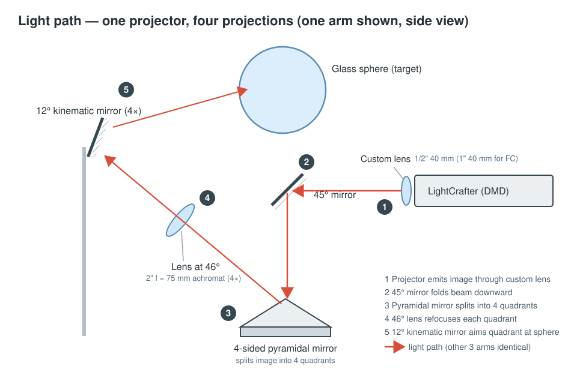
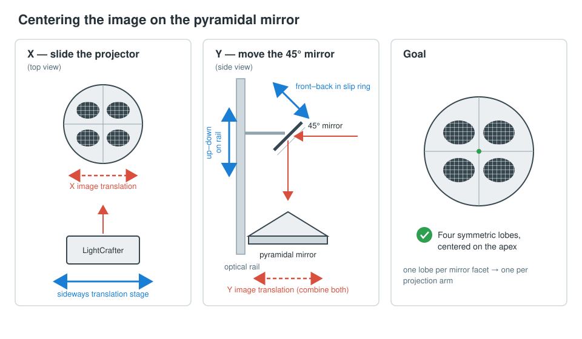
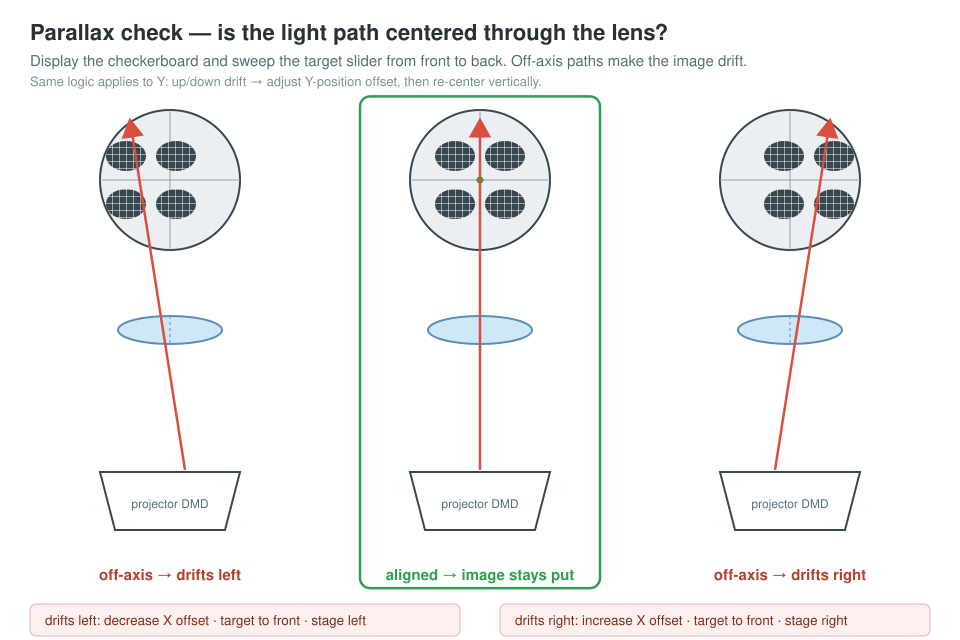
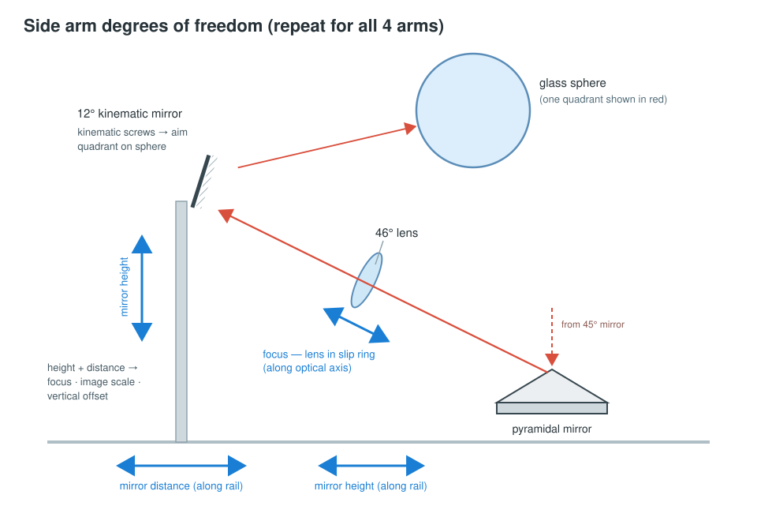

# Spherical Projection Setup — Light Path & Alignment Tutorial

This tutorial explains how the projection light path of the spherical MARINER stimulation setup works and walks you through aligning it from scratch. It is written for both new and experienced users: Section 1–2 give you the background you need to understand *why* each adjustment exists; Sections 3–5 are the hands-on procedure you can follow step by step at the rig.

---

## 1. System overview

The setup projects visual stimuli onto a **glass sphere** using a **single video projector** whose image is split into **four separate projections**, one per side of the sphere.

The main components are:

| Component                                                                          | Role |
|------------------------------------------------------------------------------------|---|
| **LightCrafter video projector** (on a sideways translation stage + dovetail rail) | Image source (DMD-based projector) |
| **Custom projection lens** — 1/2″ 40 mm lens (1″ 40 mm for the FC variant)         | Replaces/extends the stock projector optics |
| **45° mirror**                                                                     | Folds the horizontal projector beam downward |
| **4-sided pyramidal mirror**                                                       | Splits the image into four quadrants, one per projection arm |
| **4× lenses at 46° to horizontal** — 2″ f = 75 mm achromats                        | Refocus each image quadrant on its way out to the side |
| **4× kinematic mirrors at 12 to 14°**                                              | Redirect each refocused quadrant up and onto the glass sphere |
| **Fishbowl**                                                                       | The projection target |

**Why a 4-sided pyramidal mirror?** Covering the sphere from four sides gives steeper angles of incidence on the sphere surface, more even illumination, and less out-of-focus light than fewer, shallower projections would.

---

## 2. The light path, step by step

*Figure 1 — The full light path (one of the four arms shown, side view). The numbered badges match the steps below.*

Follow one image quadrant from projector to sphere:

1. The **LightCrafter** projects the full stimulus image horizontally through its **custom lens**.
2. The **45° mirror** folds the beam straight down.
3. The beam lands centered on the apex of the **4-sided pyramidal mirror**, which splits the image into its four quadrants and reflects each quadrant outward toward one of the four sides.
4. Each quadrant passes through a **46° lens** (2″ f = 75 mm achromat), which refocuses that part of the image.
5. A **12° kinematic mirror** on each side reflects the refocused quadrant back toward the center and up onto the **glass sphere**.

When everything is aligned, the four quadrants form a four-lobed pattern that is perfectly centered on the pyramidal mirror, and the four projections meet seamlessly on the sphere.

---

## 3. Before you start

- All software adjustments described below are made in the **startup configuration window** of the display software, mainly on the **DISPLAY tab**. You will use:
  - **Display calibration → Planar Checkerboard** (with its vertical/horizontal spatial-frequency settings) as the main test pattern for centering the image.
  - The **spherical mesh** pattern (or the checkerboard) for aligning the side arms.
  - The **X-position / Y-position** offset settings (Global section) and the **radial offset** and **scale** settings (Spherical section).
- The alignment order matters. Work through the sections in sequence:
  1. Center the image on the pyramidal mirror (Section 4).
  2. Fine-tune X/Y centering with the checkerboard procedure (Section 4.3).
  3. Align each of the four side arms (Section 5).

---

## 4. Center part: getting the image onto the pyramidal mirror

The goal of this stage is to have the projected image land **centered on the apex of the pyramidal mirror**, with the light path passing through the **center of the projection lens**. If the beam is off-axis through the lens or off-center on the pyramid, the four quadrants will be unevenly sized and distorted downstream (see Section 4.3 for how to detect and fix this).

*Figure 2 — The two centering adjustments and the target result: four symmetric lobes centered on the pyramid apex.*

### 4.1 X translation (left–right)

The X position of the image on the pyramidal mirror is adjusted **physically**, by moving the **LightCrafter sideways on its translation stage**. Sliding the projector left/right shifts the image left/right on the pyramid.

### 4.2 Y translation (front–back)

There is no single knob for Y. Instead, combine two movements of the **45° mirror**:

- **Up–down** movement of the mirror mount along the vertical optical rail, and
- **Forward–backward** movement of the mirror within its slip ring.

Together these shift the image along the Y axis on the pyramidal mirror. Iterate both until the four-lobed test pattern sits centered on the pyramid apex (compare with the "end result" reference: four symmetric lobes, one per mirror facet).

### 4.3 Fine centering with the Planar Checkerboard (parallax method)

Even when the image *looks* centered, it may still pass **off-axis** through the projection lens — note that with the custom lens, the image on the DMD chip itself may be off-axis. The following software-assisted procedure detects this: if the projection axis is off-center, the image will drift sideways when you change the virtual target distance.

Display the **Planar Checkerboard** pattern, then move the **target slider from front to back** and watch how the image moves.

*Figure 3 — The parallax check. Only a light path through the lens center keeps the image stationary while the target slider is swept.*

**X alignment:**

- Image drifts **left** as the target moves back:
  1. **Decrease** the **X-position** offset setting.
  2. Move the target slider back to the front.
  3. Move the **translation stage left** to re-center the image.
- Image drifts **right**:
  1. **Increase** the **X-position** offset setting.
  2. Move the target to the front.
  3. Move the **translation stage right** to re-center.

**Y alignment (same logic, vertical axis):**

- Image drifts **up** as the target moves back:
  1. **Increase** the **Y-position** offset setting.
  2. Move the target to the front.
  3. Re-center the image **upward** (using the 45° mirror rail/slip-ring adjustments from Section 4.2).
- Image drifts **down**:
  1. **Decrease** the **Y-position** offset setting.
  2. Move the target to the front.
  3. Re-center the image **downward**.

Repeat each loop until sweeping the target slider from front to back no longer shifts the image. At that point the light path is centered through the lens and on the pyramid.

---

## 5. Side arms (repeat 4×)

Each of the four projection arms is aligned independently, but with the same procedure. Each arm consists of a **46° lens** (2″ f = 75 mm achromat) and a **12° kinematic mirror**; the lens refocuses the quadrant, and the mirror sends it up onto the sphere.

*Figure 4 — All adjustment axes of one side arm, and the order in which to work through them (Sections 5.1–5.4).*

### 5.1 Find the optical center of the arm's lens

1. In the software, set a **fixed radial offset**.
2. Set the **scale multiplier small (< 0.2)** — this shrinks the quadrant to a small patch so you can see where it passes through the lens.
3. Display the **spherical mesh** or **checkerboard** pattern.
4. Adjust until the light path passes through the **center of the lens**.

> **Tip:** Low-f lenses produce pincushion distortion toward their edges — another reason the beam must go through the lens center rather than near its rim.

### 5.2 Lens alignment

The lens has two degrees of freedom:

- **Lens height** — translate the lens mount along its rail.
- **Lens focus** — translate the lens within its slip ring, along the optical axis.

### 5.3 Mirror holder alignment

The kinematic mirror's holder can be adjusted in **height** and in **distance** (along its rail). Use these to:

- move the image **into focus** on the sphere,
- **scale** the image, and
- change the **vertical image offset** on the sphere.

### 5.4 Kinematic mount fine-tuning

Finally, use the kinematic mount's adjustment screws to set the projection's:

- **Elevation** on the sphere, and
- **Azimuth** on the sphere.

This places the quadrant precisely on its quarter of the sphere. Repeat Sections 5.1–5.4 for the remaining three arms.

> **Note:** the kinematic mirror is mounted at a 45° around the optical axis, so that the adjustment screws are positioned symmetrically. This means for pure azimuth or elevation adjustments both screws need to be adjusted simultaneously.

---

## 6. Verifying the alignment

You are done when:

- The four-lobed test pattern is symmetric and centered on the pyramidal mirror (Section 4).
- Sweeping the checkerboard target slider front↔back produces no image drift in X or Y (Section 4.3).
- Each quadrant passes through the center of its side lens, is in focus on the sphere, and the four projections meet at the correct elevation and azimuth so the sphere is covered evenly from all four sides (Section 5).
